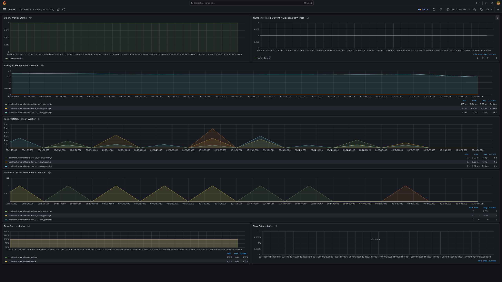

# Monitoring

Monitoring is always fun and especially when you want to see how your application performs.

We can follow the [Grafana Integration
guide](https://flower.readthedocs.io/en/latest/prometheus-integration.html#grafana-integration-guide)
to setup a local grafana dashboard and observe our app metrics.


# Prometheus
A `prometheus.yml` configuration file can be found in the `config/` folder and
we can use that to spin up our prometheus GUI.
Simply run:
```
docker run --name Prometheus -v $(pwd)/config/prometheus.yml:/etc/prometheus/prometheus.yml -p 9090:9090 --network host prom/prometheus
```
Head over to `localhost:9090` and check that Prometheus is running.

# Grafana Dashboard
Now that Prometheus is also running we can spin up our Grafana dashboard and
configure it to show Prometheus's data.

Run the following command to start Grafana:
```
docker run --name Grafana -d -v grafana-storage:/var/lib/grafana -p 3000:3000 --network host grafana/grafana
```

## Next steps
- Just follow the docs here to
[add prometheus as a data source](https://flower.readthedocs.io/en/latest/prometheus-integration.html#add-prometheus-as-a-data-source-in-grafana)

- Celery monitoring dashboard file for Grafana is also present in the `config/`
folder as `celery-monitoring-grafana-dashboard.json`.

- If all the steps are followed as mentioned in the docs then you'll have a
Grafana dashboard up and running at
[http://localhost:3000](http://localhost:3000)


And that's all folks!
